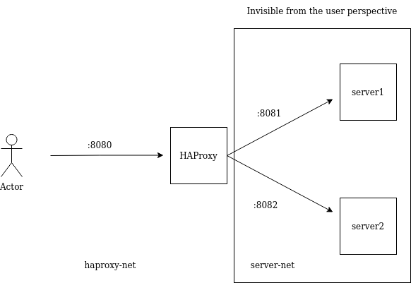

# Hello world

## Prerequisites

- [docker](https://docs.docker.com/engine/install/ubuntu/)
- [docker-compose](https://docs.docker.com/engine/install/ubuntu/)

## How to run

`docker-compose up --build --detach` from [this](.) current folder.

## How to test

Execute the [test](./test.sh) script and see how _HAProxy_ load balance the requests.

## Architecutre

